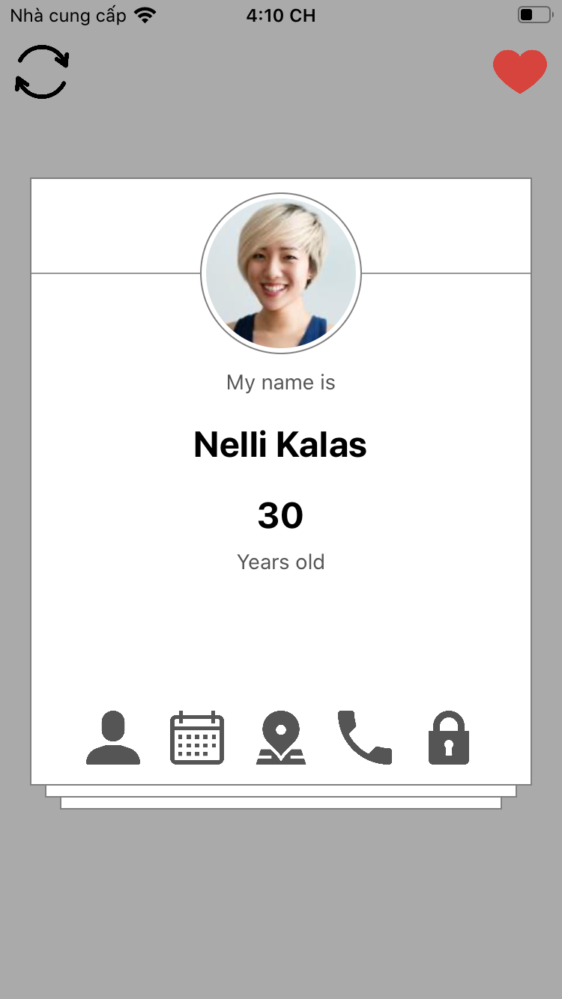
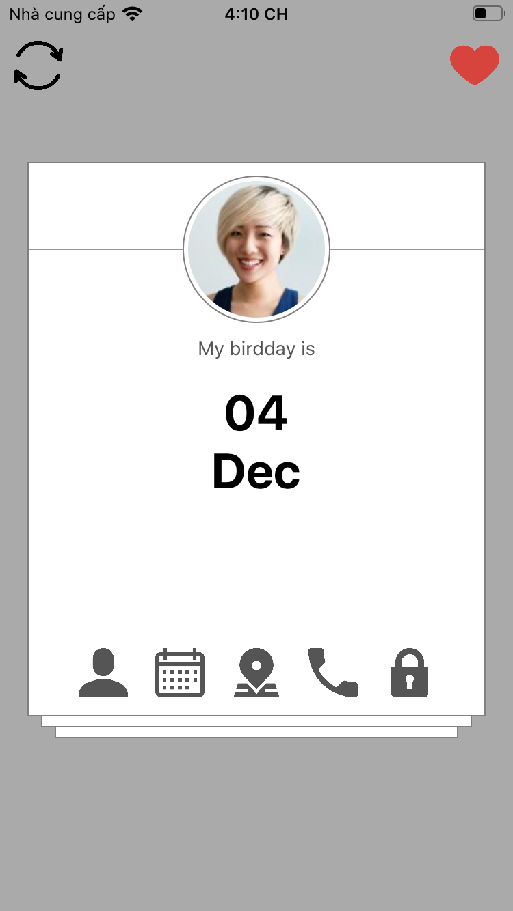
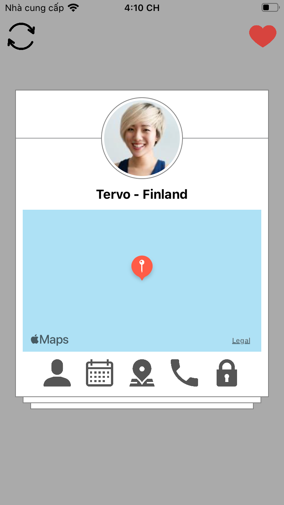
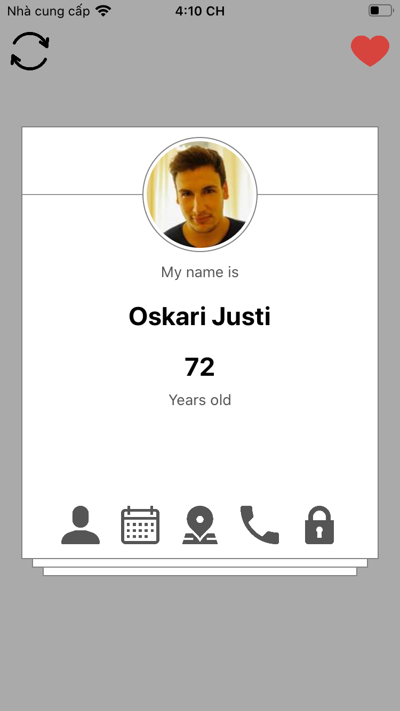
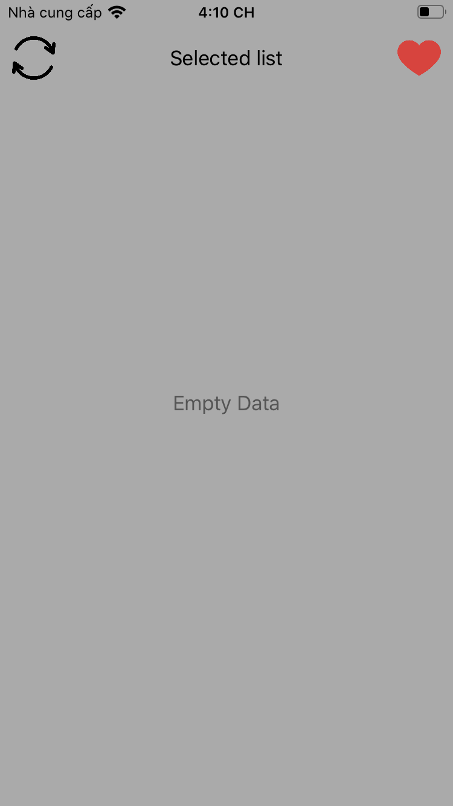
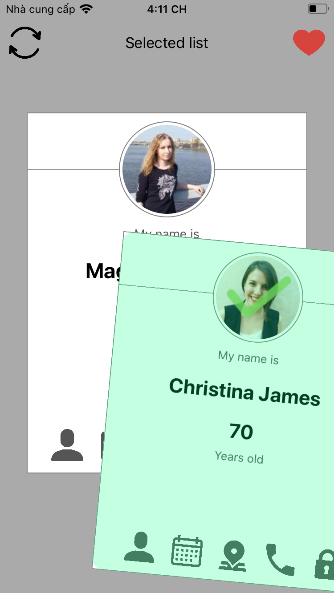

# DemoGoJek
Demo GoJek

This is a simple demo to match with Coding challenge’s requirement

- Fetch data from APIs random.me
- Cache data if swipe right
- Remove if swipe left
- Refresh function
- Show Fav list
- No extra libs require

Develop environment: XCode 11.7, swift 5

Results:

